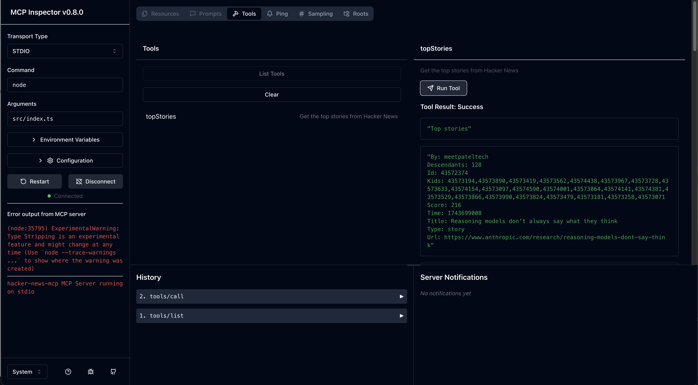

# MCP TS Quickstart

This is a quickstart for MCP in TypeScript.

It includes a basic MCP server implementation that uses the `stdio` transport,
and fetches the top stories from Hacker News.

It is written in TypeScript and works without a build step by utilizing Node v23.



## Development

The following commands will install the dependencies, and then start the MCP server with the [MCP Inspector](https://github.com/modelcontextprotocol/inspector) UI as a client.

```bash
nvm install && nvm use
pnpm install
pnpm start
```

Because the server is build-less, you can simply "restart" the server inside of the inspector UI by pressing the "Restart" button.

## Extending the server

The server is implemented in `src/index.ts`.

The `topStories` tool is implemented in `src/tools.ts`.

To add a new tool, you can copy the `topStories` tool and modify it.

When importing local src files, make sure to use the `.ts` extension so that node can resolve it.

When importing types, make sure to add the `type` keyword in front of the import so that node can strip it out at runtime.

When importing libraries, make sure to import the actual source file extension, if it does not provide an exports mapping.

## MCP Inspector

The MCP Inspector is a UI for interacting with MCP servers.

When run, it will be available at [http://localhost:6274](http://localhost:6274).
